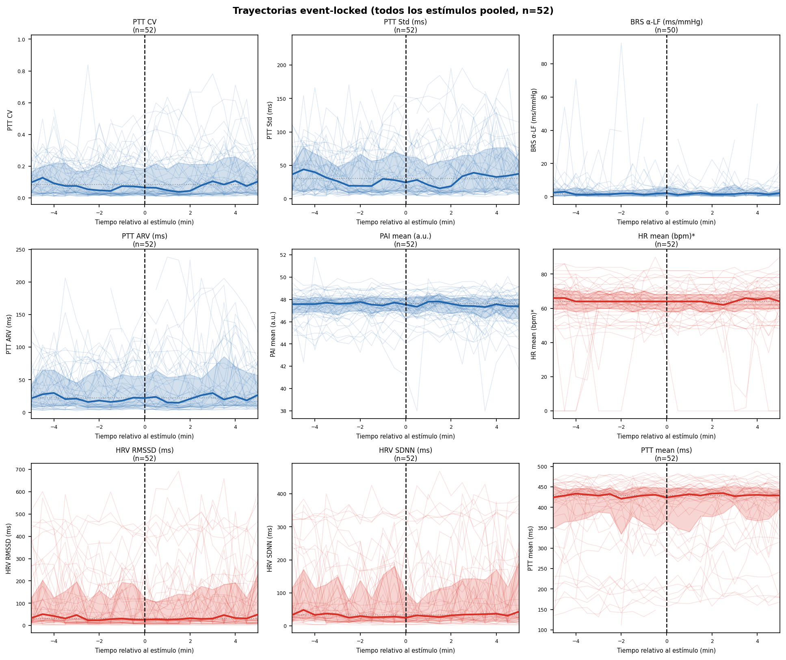
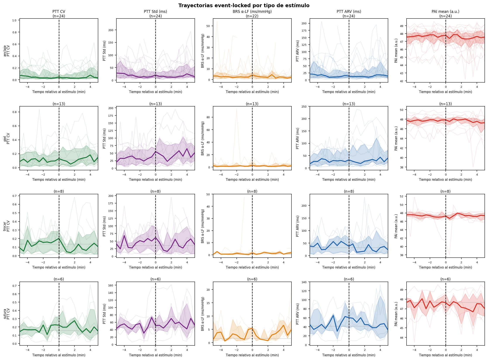
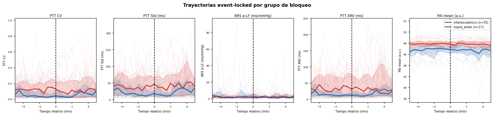

# Trajectory Diagnostic — Q1
Generado: 2026-05-08 15:40:45

## Objetivo
Determinar si la respuesta autonómica al estímulo doloroso bajo
propofol+remi+bloqueo es transitoria y si la ventana de 5 min la está diluyendo.

## Datos utilizados
- `features_long.parquet`: 83 692 ventanas 30s (paso 1s), 18 pacientes
- `event_windows.csv`: 52 eventos limpios (17 pacientes)
- Rejilla temporal: −5 a +5 min, paso 30s (21 timepoints/evento)
- Baseline definido: [−5, −2] min (índices 0…6)

## Figura A — Trayectorias pooled

*9 features (3×3). Líneas tenues = estímulos individuales. Línea gruesa = mediana.
Banda = IQR 25–75%. Línea punteada horizontal = mediana baseline. Discontinua vertical = t=0.*

## Figura B — Por tipo de estímulo

*Subcategorías omitidas por <3 eventos: fresa.*

## Figura C — Por grupo de bloqueo

*Interescalénico (n=35 eventos) vs Supra+Axilar (n=17 eventos).*

## Interpretación por feature primaria

- **ptt_cv** (esperado `-`, observado `-`): Respuesta visible: descenso de 0.56×IQR, pico a 90s, retorno en 120s. Dirección ✓ CONSISTENTE con BeatLabile.
- **ptt_std** (esperado `+`, observado `-`): Respuesta visible: descenso de 0.60×IQR, pico a 90s, retorno en 120s. Dirección ✗ CONTRARIO a BeatLabile.
- **brs_alpha_lf** (esperado `-`, observado `-`): Cambio mínimo (0.39×IQR) — por debajo del umbral de relevancia.
- **ptt_arv** (esperado `+`, observado `-`): Cambio mínimo (0.32×IQR) — por debajo del umbral de relevancia.
- **pai_mean** (esperado `-`, observado `-`): Respuesta visible: descenso de 0.53×IQR, pico a 210s, retorno en 240s. Dirección ✓ CONSISTENTE con BeatLabile.

### Notas de calidad
- Features con ≤30 eventos válidos: Ninguna
- brs_alpha_lf enmascarado cuando brs_valid=False
- hr_mean calculada como n_rr/30×60 (aprox., sin PLETH_HR disponible)

## Cuantificación del peak
| Feature | Baseline med | Peak | Peak t (s) | Magnitud (×IQR) | Retorno (s) | Dir obs | Dir exp | Match |
|---------|-------------|------|-----------|-----------------|-------------|---------|---------|-------|
| ptt_cv | 0.084 | 0.037 | 90 | 0.56 | 120 | - | - | ✓ |
| ptt_std | 30.276 | 15.569 | 90 | 0.60 | 120 | - | + | ✗ |
| brs_alpha_lf | 1.830 | 1.149 | 30 | 0.39 | 60 | - | - | ✓ |
| ptt_arv | 22.154 | 14.667 | 90 | 0.32 | 120 | - | + | ✗ |
| pai_mean | 47.635 | 47.317 | 210 | 0.53 | 240 | - | - | ✓ |

## Recomendación de ventana
- Timepoint de peak mediano observado: **90s**
- Retorno a baseline mediano: **120s**
- **Ventana sugerida**: Pre: [-5, -2] min  →  Post: [0, 150s] (2.0 min)
  > Comparado con la ventana actual de 5 min completos, esta ventana más estrecha
  > podría aumentar la relación señal/ruido en análisis A+B.

## Veredicto sobre A+B

> ### PROCEDER CON A+B PERO REDISEÑAR
> Hay respuestas (3 features), pero 1 tienen dirección contraria a lo predicho. Revisar surrogate mapping.

### Razonamiento:
- Features con respuesta visible (>0.5×IQR) y dirección correcta: **2/5**
- Features con respuesta visible pero dirección incorrecta: **1/5**
- Features sin respuesta discernible: **2/5**

---
*Fin del diagnóstico de trayectorias Q1*
